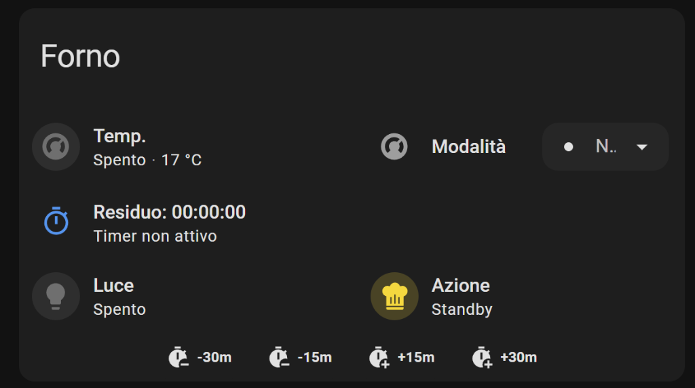

# Whirlpool Sixth Sense for Home Assistant

[](https://github.com/hacs/integration)

This is a custom Home Assistant integration for Whirlpool Sixth Sense appliances.

Specifically, this integration has been developed and tested for the **Whirlpool W9 OS2 4S1 P** (W9 line pyrolytic steam oven), but it is designed to be compatible with other Whirlpool Sixth Sense ovens and appliances using similar communication protocols.

> [!WARNING]
> This is NOT an official extension. This integration is provided "as is", without warranty of any kind. By using this integration, the user accepts all risks, including potential damage to the appliance or loss of data.

## Credits
This work is heavily based on the incredible work by [@abmantis](https://github.com/abmantis) in the [whirlpool-sixth-sense](https://github.com/abmantis/whirlpool-sixth-sense) repository. Many thanks to him for the reverse engineering and initial implementation!

## Installation
1. Install [HACS](https://hacs.xyz/).
2. Add this repository as a custom repository in HACS.
3. Search for "Whirlpool Sixth Sense" and install it.
4. Restart Home Assistant.
5. Go to Settings -> Devices & Services -> Add Integration and search for "Whirlpool Sixth Sense".

## Configuration
During the configuration flow, you will be asked for:
- **Device Name**: The name you want to give to your appliance (e.g., "Forno"). All entities will be prefixed with this name.
- **Email/Password**: Your Whirlpool account credentials.
- **Region**: Select your region (EU or US).

## User Interface
Below is an example of a Lovelace card configuration for the oven, which looks like this:



### Lovelace Code
```yaml
type: custom:vertical-stack-in-card
title: Forno
cards:
  - type: grid
    columns: 2
    square: false
    cards:
      - type: custom:mushroom-climate-card
        entity: climate.forno
        name: Temp.
        show_temperature_control: true
        hvac_modes:
          - "off"
          - heat
        collapsible_controls: true
        tap_action:
          action: more-info
      - type: tile
        entity: climate.forno
        name: Modalità
        icon: ""
        hide_state: true
        vertical: false
        features:
          - style: dropdown
            type: climate-preset-modes
            preset_modes:
              - Statico
              - Cottura ventilata
              - Grill
              - Turbo grill
              - Maxi cooking
              - Mantenere in caldo
              - Termoventilato
              - Vapore
              - Speciale lievitazione
              - Preriscaldamento veloce
              - none
        features_position: inline
  - type: horizontal-stack
    cards:
      - type: custom:mushroom-template-card
        entity: sensor.forno_forno_timer_display
        primary: "Residuo: {{ states('sensor.forno_forno_timer_display') }}"
        secondary: >
           
            {# Estraiamo ore e minuti dal formato HH:MM:SS #}
            
            
            
            
            Fine alle {{ (now() + timedelta(minutes=total_minuti)).strftime('%H:%M') }}
          
            Timer non attivo
          
        icon: mdi:timer-outline
        tap_action:
          action: more-info
        color: |
          
            orange
          
            blue
          
        features_position: bottom
  - type: horizontal-stack
    cards:
      - type: custom:mushroom-light-card
        entity: switch.forno_luce
        name: Luce
        use_light_color: true
      - type: custom:mushroom-entity-card
        entity: sensor.forno_forno_stato
        name: Azione
        icon: mdi:chef-hat
  - type: custom:mushroom-chips-card
    alignment: center
    chips:
      - type: entity
        entity: button.forno_timer_30m_subtract
        name: "-30m"
        content_info: name
      - type: entity
        entity: button.forno_timer_15m_subtract
        name: "-15m"
        content_info: name
      - type: entity
        entity: button.forno_timer_15m_add
        name: +15m
        content_info: name
      - type: entity
        entity: button.forno_timer_30m_add
        name: +30m
        content_info: name
```
